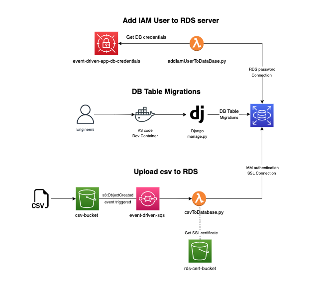

# Event Driven app

This S3 event-driven app uses the principle of decoupling, least-privilege access, and data encryption. There are three operations in this app. First of all, after building cloud resources from terraform, run addIamUserToDataBase lambda to create a new IAM user in the rds server. Once the IAM user account is set properly, the user can perform Django migrations to update tables in the rds. Lastly, to trigger the S3 event, upload the CSV file to the S3 bucket, the S3 bucket will notify the sqs queue with an event body that contains information about the CSV file, and csvToDataBase lambda will process the CSV and update the corresponding rds table. 

 
  

## Prerequisites
[AWS CLI Setup](https://docs.aws.amazon.com/cli/latest/userguide/cli-configure-quickstart.html)